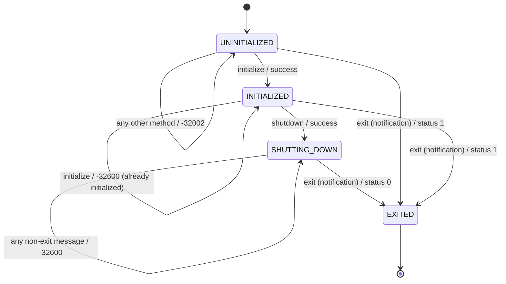

# Lifecycle

Every WSP server is a small finite-state machine. The states are
`UNINITIALIZED`, `INITIALIZED`, `SHUTTING_DOWN`, and `EXITED`, and three
methods drive the transitions: `initialize`, `shutdown`, and the `exit`
notification.



## Initialize

Every WSP session begins with an `initialize` request:

```json
{
  "jsonrpc": "2.0",
  "method": "initialize",
  "params": {
    "client_name": "my-client",
    "client_protocol_version": "0.1.0"
  },
  "id": 1
}
```

The response carries the server's capabilities:

```json
{
  "jsonrpc": "2.0",
  "result": {
    "methods": ["environment/list", "initialize", "shutdown"],
    "protocol_version": "0.1.0"
  },
  "id": 1
}
```

Until `initialize` succeeds, every other method receives JSON-RPC error
`-32002` (server not initialized). A second `initialize` after the first
has succeeded is rejected with `-32600` (invalid request); the cached
capabilities from the first call are preserved.

## Shutdown

A `shutdown` request asks the server to stop accepting new requests:

```json
{"jsonrpc": "2.0", "method": "shutdown", "id": 2}
```

After a successful `shutdown`, only the `exit` notification is honoured.
Any other request is rejected with `-32600`.

## Exit

The `exit` notification (no `id`) terminates the server:

```json
{"jsonrpc": "2.0", "method": "exit"}
```

The process exit status depends on whether `shutdown` ran first:

- `exit` after a successful `shutdown` → exit status `0`.
- `exit` from any other state → exit status `1`.

## EOF drain

Closing stdin is also a clean way to end a session. The runtime waits up to
five seconds for in-flight handler tasks to finish, cancels anything still
running, flushes stdout, and exits with status `0`. This is what the `wsp`
CLI uses to wind down servers it spawned, and it's what the integration
tests rely on for graceful teardown.

## Why this matters

The lifecycle FSM exists for two reasons:

1. **Capability discovery.** Clients need to know what the server supports
   before issuing any other request, and `initialize` is the only chance to
   negotiate.
2. **Predictable teardown.** A `shutdown`-then-`exit` flow lets the server
   distinguish a clean shutdown (status `0`) from an abrupt one
   (status `1`), which matters for supervisors and CI systems.
